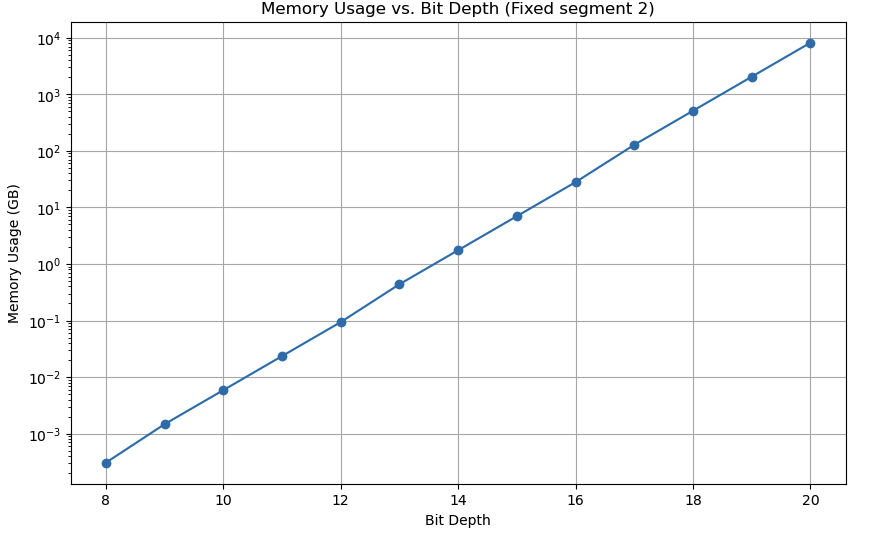
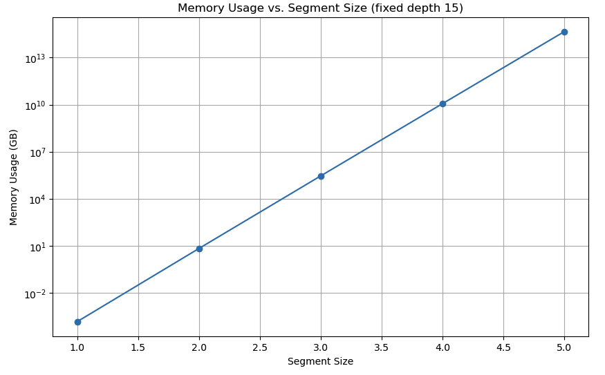

# neuralink-challenge-lookuptable
A brute force lookup table approach at the Neuralink challenge for the lulz. 

> What if we hash the data, and the server holds a lookup table of all combinations? 

## Part 1 - Generate a lookup table with all possible combinations

To get a 1.25% compression, Represent 30 bytes using 24 byte key:
```
bit_depth = 15
segment_size = 2   
hash_size_bytes = 3  # Truncated SHA-256 hash size in bytes (3 bytes = 24 bits)
```

Throw some more memory at the server and you can increase the `hash_size_bytes` to avoid theoretical hash collisions. 

Increase the depth or size to improve your compression ratio - but again the decode db will be much larger. 



The bit depth is easier to scale than the segment size:



Thus for a 1.33% you'd represent 32 using 24:
```
bit_depth = 16
segment_size = 2   
hash_size_bytes = 3
```

## Part 2 - Run eval using the challenge dataset

```
594M nl_bit15_seg2_hash3.db
{'file_name': '102b47d9-371e-412a-8995-0dc6115ab2bb.wav', 'compression_ratio': 1.2500126648969585, 'percentage_found': 100.0}
{'file_name': '2eef5d4d-93d1-4c0e-9d23-0989abaa34d0.wav', 'compression_ratio': 1.2500126620745542, 'percentage_found': 100.0}

```